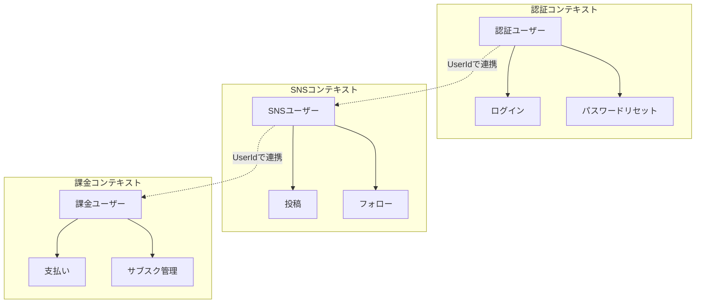

# 第1回：なぜドメイン駆動設計が必要なのか

## 🤔 あなたはこんな経験ありませんか？

```typescript
// よくある「とりあえず動く」コード
async function createPost(req: Request, res: Response) {
  const { text, imageUrl } = req.body;
  
  // バリデーション？どこに書く？
  if (!text && !imageUrl) {
    return res.status(400).json({ error: "投稿内容が必要です" });
  }
  
  if (text && text.length > 300) {
    return res.status(400).json({ error: "300文字以内で" });
  }
  
  // DBに保存
  const post = await db.collection('posts').add({
    text,
    imageUrl,
    authorId: req.user.id,
    likeCount: 0,  // これ、どこで管理すべき？
    createdAt: new Date()
  });
  
  // 通知処理？ここに書く？
  const followers = await getFollowers(req.user.id);
  for (const follower of followers) {
    await sendNotification(follower, `${req.user.name}が投稿しました`);
  }
  
  res.json({ id: post.id });
}
```

このコードの問題点：
- **ビジネスルールが散在**（300文字制限はどこで管理？）
- **責任が不明確**（通知処理はここでやるべき？）
- **テストが困難**（DBとAPIが密結合）
- **変更に弱い**（仕様変更で複数箇所を修正）

## 🎯 まず、ビジネスを分析しよう

### サブドメインの分類：何が本当に重要か？

SNSというビジネスを分析すると、3種類のサブドメインが見えてきます：

```
[SNSビジネス全体]
 ├─ 中核ドメイン（差別化要素）
 │   └─ ソーシャルグラフ（独自のつながり方）
 │   └─ コンテンツ配信アルゴリズム
 ├─ 支援ドメイン（補助業務）
 │   └─ コンテンツ管理
 │   └─ 通知システム
 └─ 汎用ドメイン（共通基盤）
     └─ 認証・認可
     └─ ファイルストレージ
```

**中核ドメイン**こそがDDDの投資対象です。なぜなら：
- 競争優位性の源泉
- ビジネス価値が最も高い
- 独自のロジックが集中

一方、汎用ドメインはFirebase Authのような既製品で十分です。

## 📚 ドメイン駆動設計とは何か

**ドメイン駆動設計（DDD）**は、**ビジネスの複雑さ**と**ソフトウェアの複雑さ**を整理する設計手法です。

### 核心的な問い

> 「このコードは**ビジネスの言葉**で説明できますか？」

例えば：
- 「投稿には本文か画像が必須」→ **ビジネスルール**
- `req.body.text` → **技術的な詳細**

DDDは、ビジネスルールを**ドメインモデル**として表現します。

## 🏗️ ドメインモデルで表現する

### Before：技術中心の実装

```typescript
// データベースのスキーマがそのまま露出
interface PostData {
  text: string;
  imageUrl: string | null;
  authorId: string;
  likeCount: number;
  createdAt: Date;
}

// ビジネスルールがあちこちに散在
function validatePost(data: PostData): boolean {
  // どこかのutil関数...
  return (data.text || data.imageUrl) && data.text.length <= 300;
}
```

### After：ドメインモデル中心の実装

```typescript
// ドメインモデル：ビジネスの概念を表現
export class Post {
  private constructor(
    readonly id: PostId,
    readonly authorId: UserId,
    private _text: string,
    private _imageUrl: string | null,
    readonly createdAt: Date
  ) {}
  
  // ファクトリメソッド：生成時の不変条件を保証
  static create(args: {
    id: PostId,
    authorId: UserId,
    text: string,
    imageUrl?: string | null,
    now: Date
  }): Post {
    // ビジネスルール1：投稿には内容が必須
    const hasContent = args.text.trim() || args.imageUrl;
    if (!hasContent) {
      throw new EmptyPostError("投稿には本文または画像が必要です");
    }
    
    // ビジネスルール2：文字数制限
    if (args.text.length > 300) {
      throw new PostTextTooLongError("投稿は300文字以内にしてください");
    }
    
    return new Post(
      args.id,
      args.authorId,
      args.text.trim(),
      args.imageUrl ?? null,
      args.now
    );
  }
  
  // ビジネスロジック：投稿の編集
  edit(editorId: UserId, newText: string): void {
    // ビジネスルール：作成者のみ編集可能
    if (this.authorId !== editorId) {
      throw new UnauthorizedEditError("投稿は作成者のみ編集可能です");
    }
    
    // 編集でも不変条件を維持
    if (!newText.trim() && !this._imageUrl) {
      throw new EmptyPostError("投稿を空にすることはできません");
    }
    
    this._text = newText.trim();
  }
}
```

### なぜこれが良いのか？

1. **ビジネスルールが一箇所に集約**
   - Postクラスを見れば、投稿の仕様がすべてわかる

2. **不正な状態を作れない**
   - コンストラクタがprivateなので、必ずcreateメソッドを通る
   - 不変条件が常に保証される

3. **ビジネスの言葉で実装**
   - `edit()` = 「投稿を編集する」
   - `EmptyPostError` = 「空の投稿エラー」

## 🌍 ユビキタス言語：ドメインエキスパートと同じ言葉を使う

### 業務知識の発見プロセス

```
エンジニア ←──[モデル]──→ ドメインエキスパート
         （同じ言葉で会話する）
```

DDDの本質は、**ドメインエキスパートとの協働**です：

1. **知識の抽出**：ビジネスの専門家から深い知識を学ぶ
2. **言語の統一**：曖昧な用語を明確に定義する
3. **モデルの進化**：理解が深まるごとに改善

### ❌ 悪い例：技術用語とビジネス用語の混在

```typescript
// 開発者「レコードをインサートする」
await db.posts.insert(postData);

// プロダクトマネージャー「投稿を公開する」
// マーケター「バズを生む」
// ユーザー「つぶやく」

// 同じ行為なのに、みんな違う言葉を使っている！
```

### ✅ 良い例：ユビキタス言語の確立

```typescript
// ドメインエキスパートとの対話から生まれた言語
interface PostDomainLanguage {
  投稿: "ユーザーが作成するコンテンツの単位";
  公開: "フォロワーのタイムラインに表示可能にすること";
  バズる: "エンゲージメント率が閾値を超えること";
  
  // これらの定義は全員で合意済み
}

class CreatePost {
  execute(input: { content: string }): Post {
    // ユビキタス言語をそのままコードに
    const post = Post.create({
      // ...
    });
    
    // 「投稿」を「公開」する（全員が理解できる）
    await this.postRepository.publish(post);
    
    if (post.isBuzzworthy()) {
      // 「バズる」の定義も共有されている
      await this.notifyTrending(post);
    }
    
    return post;
  }
}
```

**ユビキタス言語の効果**：
- プロダクトマネージャー：「投稿を作成する機能を追加したい」
- 開発者：「CreatePostユースケースを実装します」
- コード：`class CreatePost`
- ドキュメント：同じ用語で記述

→ **全員が同じ言葉で会話できる！**

## 🔲 境界づけられた文脈：複雑さを分割統治

### 問題：同じ「ユーザー」でも文脈によって意味が違う

```typescript
// 認証文脈のユーザー
interface AuthUser {
  email: string;
  hashedPassword: string;
  lastLoginAt: Date;
}

// SNS文脈のユーザー
interface SocialUser {
  displayName: string;
  bio: string;
  followerCount: number;
}

// 課金文脈のユーザー
interface BillingUser {
  customerId: string;
  subscription: 'free' | 'premium';
  paymentMethod: PaymentMethod;
}
```

### 解決：境界づけられた文脈で分離



### コンテキスト間の3つの関係性

**1. 良きパートナー（Partnership）**
```typescript
// SNSチームと通知チームが協調
interface PartnershipExample {
  // 両チームが同じゴールに向かって協力
  SNSContext: "投稿を作成";
  NotificationContext: "リアルタイムで通知";
  
  coordination: "定期的な同期ミーティング";
  sharedGoal: "ユーザーエンゲージメント向上";
}
```

**2. 利用者/供給者（Customer-Supplier）**
```typescript
// 認証チーム（供給者）→ SNSチーム（利用者）
interface CustomerSupplierExample {
  supplier: {
    team: "認証チーム";
    provides: "認証API";
    sla: "99.9% 稼働率";
  };
  
  customer: {
    team: "SNSチーム";
    needs: ["ユーザー検証", "権限確認"];
    influence: "要望を出せるが決定権はない";
  };
}
```

**3. 独立（Separate Ways）**
```typescript
// 各チームが独自の道を行く
interface SeparateWaysExample {
  SNSContext: "独自のユーザープロフィール管理";
  BillingContext: "独自の顧客管理";
  
  integration: "最小限のID連携のみ";
  benefit: "それぞれ最適な設計が可能";
}
```

**各文脈は独立して進化できる**：
- 認証チームは2要素認証を追加
- SNSチームはストーリー機能を追加
- 課金チームは新しい料金プランを追加

→ お互いに影響を与えない！

## 💡 DDDがもたらす本質的な価値

### 1. ビジネスとコードの一致

```typescript
// ビジネス要件：「フォロワーが1000人を超えたらインフルエンサーバッジを付与」

class User {
  becomeInfluencer(): void {
    if (this.followerCount >= 1000) {
      this.badges.add(Badge.INFLUENCER);
      // ドメインイベントを発行
      this.addEvent(new UserBecameInfluencer(this.id));
    }
  }
}

// コードがビジネス要件をそのまま表現している！
```

### 2. 変更に強い設計

```typescript
// 新要件：「投稿に位置情報を追加」

// Before（手続き的）：10箇所以上の修正が必要...
// After（DDD）：Postクラスに追加するだけ

class Post {
  private _location?: Location;
  
  addLocation(location: Location): void {
    // ビジネスルール：プライバシー設定を確認
    if (this.author.privacySettings.allowLocation) {
      this._location = location;
    }
  }
}
```

### 3. 知識の蓄積

```typescript
// チームの学びがコードに蓄積される
class Post {
  // 「なぜ300文字？」→ 可読性とエンゲージメントの最適値
  private static readonly MAX_LENGTH = 300;
  
  // 「なぜ画像は1枚？」→ 複数画像はストーリー機能で差別化
  private static readonly MAX_IMAGES = 1;
  
  // ビジネス知識がコードにドキュメント化される
}
```

## 🎯 この連載で学ぶこと

1. **戦略的設計**
   - 境界づけられた文脈の見つけ方
   - コンテキストマップの描き方
   - チーム構造との整合

2. **戦術的設計**
   - エンティティと値オブジェクト
   - 集約とリポジトリ
   - ドメインサービスとドメインイベント

3. **実装パターン**
   - レイヤードアーキテクチャ
   - ヘキサゴナルアーキテクチャ
   - CQRSとイベントソーシング

## 📝 まとめ：DDDの本質

DDDは単なる実装パターンではありません。

**ビジネスの複雑さに立ち向かうための思考法**です。

- コードは**ビジネスを映す鏡**
- 開発者は**ドメインエキスパート**と協働
- ソフトウェアは**ビジネス知識の結晶**

## 🎯 次回予告

第2回では、**値オブジェクトとエンティティ**の本質的な違いを学びます：
- なぜIDが必要なのか？
- 不変性がもたらす安全性
- ビジネスルールの置き場所

実際にSNSのドメインモデルを設計しながら、DDDの核心に迫ります！

---

## 📝 演習課題

### 課題1：サブドメインの分析
あなたが作ろうとしているアプリケーション（またはSNS）を3つのサブドメインに分けてみましょう：

```
[あなたのビジネス]
 ├─ 中核ドメイン：
 │   └─ （差別化要素は何？）
 ├─ 支援ドメイン：
 │   └─ （どんな補助業務がある？）
 └─ 汎用ドメイン：
     └─ （既製品で代替できるものは？）
```

**ヒント**：「これがなくなったらビジネスが成立しない」ものが中核ドメインです。

### 課題2：ユビキタス言語の整理
以下の用語について、あなたのチームではどう呼んでいますか？

| 概念 | 開発者の呼び方 | ビジネス側の呼び方 | 統一した言葉 |
|------|---------------|-------------------|------------|
| ユーザーが何かを投稿する | | | |
| 他のユーザーをフォローする | | | |
| 投稿に反応する | | | |

### 課題3：文脈の境界を見つける
「ユーザー」という概念が、異なる文脈でどう変わるか考えてみましょう：

- 認証文脈での「ユーザー」に必要な属性：
- SNS文脈での「ユーザー」に必要な属性：
- 分析文脈での「ユーザー」に必要な属性：

**宿題**：これらの演習を通じて、あなたのシステムで「ビジネスの言葉」と「コードの言葉」が一致していない部分を3つ見つけてみてください。