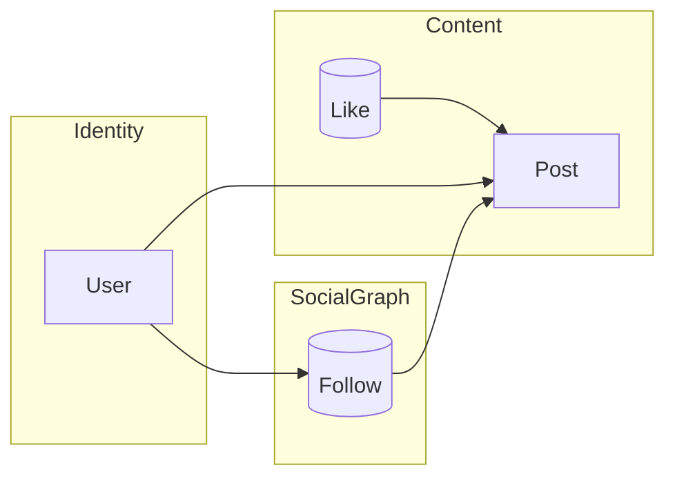

# 第1回：DDDの最短コース + なぜAll Firebaseか

## 🎯 完成像デモ


**作るもの（MVP）**：
- ✅ サインイン（Google）
- ✅ 投稿（テキスト + 画像1枚まで）
- ✅ タイムライン（フォロー相手の新着）
- ✅ いいね / フォロー
- ✅ プロフィール編集

## 📚 DDD超要約（文脈/集約/レイヤ）

### 境界づけられた文脈（Bounded Context）



**3つの文脈に分割**：
- **Identity**：ユーザ登録・プロフィールの基本
- **SocialGraph**：フォロー/フォロワー関係
- **Content**：Post/Like/Timeline 投影

### 集約（Aggregate）

集約は「**不変条件を守る単位**」です：

- **User**：プロフィール編集の不変条件を担保
- **Post**：「投稿の作成/編集」「いいね付与/解除」の不変条件を担保
- **FollowRelation**：フォローの重複禁止・自己フォロー禁止
- **Like**：`UserId x PostId` のユニーク制約

> 💡 Firestoreは**強い整合トランザクションがコレクション間で弱い**ため、不変条件はできるだけ「単一集約内」に閉じる

### レイヤーアーキテクチャ

```mermaid
flowchart TB
  UI[React Components] --> APP[Application UseCases]
  APP --> PORTS[(Ports: Repository, Storage)]
  PORTS --> INFRA[Infrastructure: Firebase adapters]
  subgraph Domain (pure TS)
    ENT[Entities / Aggregates]
    VO[ValueObjects]
    EVT[DomainEvents]
  end
  APP --> ENT
  APP --> EVT
```

## 🔥 なぜAll Firebaseか

### Firebaseで余計な配線を減らし**設計学習に集中**する狙い

通常のDDD実践では、以下のような「配線作業」に時間を取られます：

- DBコネクション管理
- 認証システムの構築
- ファイルアップロード処理
- デプロイ環境の準備

**Firebaseなら全部入り**：
- **Auth**：Google/Twitter/GitHub認証が数行
- **Firestore**：NoSQLでスケーラブル
- **Storage**：画像・動画アップロード
- **Hosting**：CDN配信込み
- **Emulators**：ローカル開発環境

結果として、**ドメインモデルの設計に集中**できます！

## 🏗️ リポジトリ構成と思想

```
sns-ddd-firebase/
├─ packages/
│  ├─ domain/                 # 純TS: Entity/ValueObject/Aggregate/DomainEvents
│  ├─ application/            # UseCase (サービス) + ポート（Repository IF）
│  ├─ infrastructure/         # Firebase 実装（Firestore/Storage/Auth）+ mappers
│  └─ web/                    # React(Vite) UI（presentation層）
├─ functions/                 # （任意）Cloud Functions（集約超えの非同期処理）
├─ firebase.json              # Hosting / Emulators 設定
├─ firestore.indexes.json
├─ firestore.rules
├─ storage.rules
└─ .github/workflows/deploy.yml（任意）
```

### ポイント

- `domain` は **Firebase無知**。型＆不変条件＆ビジネスルールに集中
- `application` は **UseCase**（例：`CreatePost`, `FollowUser`）。複数Repoを協調、**トランザクション境界**の意識付け
- `infrastructure` が Firebase SDK を握る。**DTO ↔︎ ドメイン**をMapperで変換
- `web` はコンポーネントから UseCase を呼び出すだけ。UIロジックとドメインを分離

## 🚀 環境構築（5分）

```bash
# プロジェクト作成
mkdir sns-ddd-firebase
cd sns-ddd-firebase

# pnpm workspace設定
cat > pnpm-workspace.yaml << 'EOF'
packages:
  - 'packages/*'
  - 'functions'
EOF

# package.json
cat > package.json << 'EOF'
{
  "name": "sns-ddd-firebase",
  "private": true,
  "scripts": {
    "dev": "pnpm -C packages/web dev",
    "build": "pnpm -r build",
    "test": "pnpm -r test",
    "emulator": "firebase emulators:start"
  },
  "devDependencies": {
    "@types/node": "^20.11.0",
    "typescript": "^5.3.3"
  }
}
EOF

# Firebase初期化
firebase init
# Firestore, Storage, Hosting, Emulators を選択
```

## 📊 Firestore データモデル（最小）

```
/users/{userId}             // Identity
  - displayName
  - photoURL
  - createdAt

/follows/{userId}/to/{followeeId}     // SocialGraph
  - createdAt

/posts/{postId}             // Content
  - authorId
  - text
  - imageUrl
  - likeCount
  - createdAt

/likes/{postId}/by/{userId} // Content: いいね
  - createdAt
```

**インデックス例**：
- `posts`：`createdAt DESC` + `authorId`（ユーザ別新着）
- timeline は今回は **クエリ合成**で簡易に（フォロー先一覧→ in句で取得）

## 🔐 セキュリティルール骨子

```javascript
// firestore.rules（概念的イメージ）
match /databases/{db}/documents {
  function isSignedIn()     { return request.auth != null; }
  function isSelf(uid)      { return isSignedIn() && request.auth.uid == uid; }

  match /users/{uid} {
    allow read: if true;
    allow create: if isSelf(uid);
    allow update: if isSelf(uid);
  }

  match /posts/{postId} {
    allow read: if true;
    allow create: if isSignedIn();
    allow update, delete: if resource.data.authorId == request.auth.uid;
  }
}
```

## 📝 学びの要点まとめ（3行）

1. **DDDの文脈分離**でシステムを意味のある境界で分割
2. **Firebase**で配線作業を削減し、ドメイン設計に集中
3. **レイヤー分離**でビジネスロジックをインフラから独立

## 🎯 次回予告

第2回では、**ドメインモデルを書く（純TS）**：
- ValueObject / Entity / Aggregate の実装
- 不変条件・ガードの置き場
- 単体テスト（Vitest）でドメインを守る

実際にコードを書きながら、DDDの核心に迫ります！