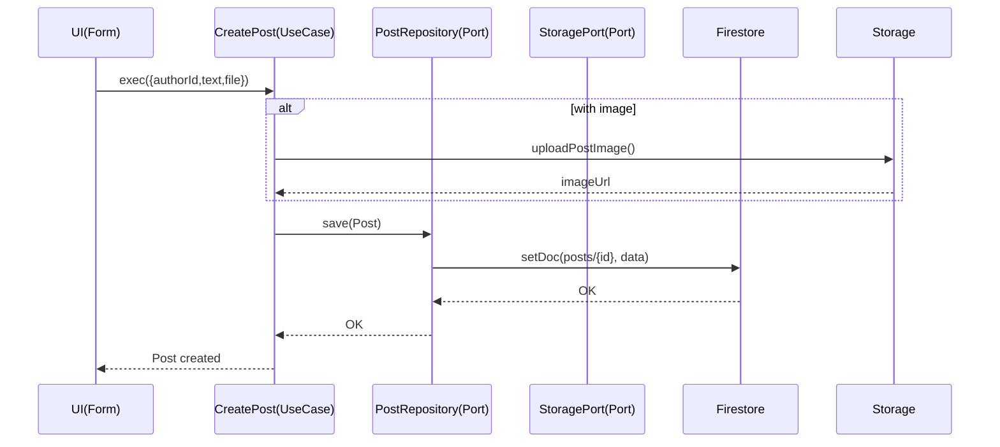

# 第3回：アプリケーションサービス（UseCase）とポート

前回はドメインモデルを実装しました。今回は**アプリケーション層**で、ユースケースとポートを設計します。

## 🎯 アプリケーション層の役割



## 🔌 ポート設計（Repository / Storage）

### PostRepository（ポート）

```typescript
// packages/application/src/ports/PostRepository.ts
import { Post } from "@domain/post/Post";
import { PostId } from "@domain/shared/ids";

export interface PostRepository {
  save(post: Post): Promise<void>;
  findById(id: PostId): Promise<Post | null>;
}
```

**ポイント**：
- インターフェースのみ定義（実装はインフラ層）
- ドメインモデルを引数/戻り値に使用
- Firebaseの詳細は一切含まない

### StoragePort

```typescript
// packages/application/src/ports/StoragePort.ts
import { PostId } from "@domain/shared/ids";

export interface StoragePort {
  uploadPostImage(id: PostId, file: File): Promise<string>;
}
```

## 📝 UseCase実装

### CreatePost（投稿作成）

```typescript
// packages/application/src/usecases/CreatePost.ts
import { nanoid } from "nanoid";
import { Post } from "@domain/post/Post";
import { PostId, UserId } from "@domain/shared/ids";
import { PostRepository } from "../ports/PostRepository";
import { StoragePort } from "../ports/StoragePort";

export class CreatePost {
  constructor(
    private posts: PostRepository, 
    private storage: StoragePort
  ) {}

  async exec(input: {
    authorId: string; 
    text: string; 
    file?: File | null;
  }) {
    // 1. ID生成
    const id = PostId(nanoid());
    const authorId = UserId(input.authorId);
    
    // 2. 画像アップロード（あれば）
    let imageUrl: string | null = null;
    if (input.file) {
      imageUrl = await this.storage.uploadPostImage(id, input.file);
    }
    
    // 3. ドメインモデル生成（不変条件チェック）
    const post = Post.create({
      id, 
      authorId, 
      text: input.text, 
      imageUrl, 
      now: new Date(),
    });
    
    // 4. 永続化
    await this.posts.save(post);
    
    return post;
  }
}
```

**責務の分離**：
- **UseCase**：業務フローの調整
- **Domain**：ビジネスルールの実装
- **Port**：外部サービスとの接続点

### FollowUser（フォロー）

```typescript
// packages/application/src/usecases/FollowUser.ts
export class FollowUser {
  constructor(
    private users: UserRepository,
    private follows: FollowRepository
  ) {}

  async exec(input: {
    followerId: string;
    followeeId: string;
  }) {
    const followerId = UserId(input.followerId);
    const followeeId = UserId(input.followeeId);
    
    // 1. ユーザー存在確認
    const [follower, followee] = await Promise.all([
      this.users.findById(followerId),
      this.users.findById(followeeId)
    ]);
    
    if (!follower || !followee) {
      throw new Error("ユーザーが存在しません");
    }
    
    // 2. 重複チェック
    const existing = await this.follows.findByPair(
      followerId, 
      followeeId
    );
    
    if (existing) {
      throw new Error("既にフォローしています");
    }
    
    // 3. フォロー関係作成（ドメインロジック）
    const follow = FollowRelation.create(
      followerId,
      followeeId,
      new Date()
    );
    
    // 4. 永続化
    await this.follows.save(follow);
  }
}
```

### ToggleLike（いいね切り替え）

```typescript
// packages/application/src/usecases/ToggleLike.ts
export class ToggleLike {
  constructor(
    private posts: PostRepository,
    private likes: LikeRepository
  ) {}

  async exec(input: {
    userId: string;
    postId: string;
  }) {
    const userId = UserId(input.userId);
    const postId = PostId(input.postId);
    
    // 1. 投稿取得
    const post = await this.posts.findById(postId);
    if (!post) {
      throw new Error("投稿が見つかりません");
    }
    
    // 2. いいね状態確認
    const existingLike = await this.likes.findByUserAndPost(
      userId, 
      postId
    );
    
    if (existingLike) {
      // 3a. いいね解除
      await this.likes.delete(existingLike);
      post.applyLike(-1);  // ドメインロジック
    } else {
      // 3b. いいね追加
      const like = Like.create(userId, postId, new Date());
      await this.likes.save(like);
      post.applyLike(1);   // ドメインロジック
    }
    
    // 4. 投稿のカウンター更新
    await this.posts.save(post);
    
    return { liked: !existingLike };
  }
}
```

## 🔄 「トランザクション境界」の現実（Firestoreの制約との向き合い方）

### 理想と現実

**理想（RDBMSの場合）**：
```typescript
// トランザクション内で複数集約を更新
await db.transaction(async (tx) => {
  await tx.save(post);
  await tx.save(like);
  await tx.updateCounter(likeCount);
});
```

**現実（Firestoreの場合）**：
```typescript
// Firestoreのトランザクションは制限が多い
// - 最大500ドキュメント
// - 読み取り後の書き込みのみ
// - クロスコレクションは弱い
```

### 対策1: 集約内で完結させる

```typescript
export class Post {
  // いいね数をPost集約内で管理
  private _likeCount: number;
  
  applyLike(delta: 1 | -1) {
    // カウンターを集約内で更新
    this._likeCount = Math.max(0, this._likeCount + delta);
  }
}
```

### 対策2: 結果整合性を受け入れる

```typescript
export class ToggleLike {
  async exec(input: Input) {
    // 1. いいねを保存
    await this.likes.save(like);
    
    try {
      // 2. カウンター更新（失敗しても続行）
      post.applyLike(1);
      await this.posts.save(post);
    } catch (error) {
      // ログに記録して、後でバッチ修正
      console.error("カウンター更新失敗", error);
    }
  }
}
```

### 対策3: セキュリティルールで補強

```javascript
// firestore.rules
match /likes/{postId}/by/{userId} {
  // 重複いいねを防ぐ
  allow create: if !exists(/databases/$(database)/documents/likes/$(postId)/by/$(userId));
}
```

## 🧪 UseCaseのテスト

```typescript
// packages/application/src/usecases/CreatePost.test.ts
import { describe, it, expect, vi } from 'vitest';
import { CreatePost } from './CreatePost';

describe('CreatePost', () => {
  it('画像付き投稿を作成できる', async () => {
    // モックの準備
    const mockRepo = {
      save: vi.fn()
    };
    const mockStorage = {
      uploadPostImage: vi.fn().mockResolvedValue('https://example.com/image.jpg')
    };
    
    // UseCase実行
    const useCase = new CreatePost(mockRepo, mockStorage);
    const result = await useCase.exec({
      authorId: 'user-1',
      text: 'テスト投稿',
      file: new File([''], 'test.jpg')
    });
    
    // 検証
    expect(mockStorage.uploadPostImage).toHaveBeenCalled();
    expect(mockRepo.save).toHaveBeenCalled();
    expect(result.text).toBe('テスト投稿');
    expect(result.imageUrl).toBe('https://example.com/image.jpg');
  });
});
```

## 📝 学びの要点まとめ（3行）

1. **ポート**で外部依存を抽象化
2. **UseCase**で業務フローを実装
3. **トランザクション境界**は現実的に設計

## 🎯 次回予告

第4回では、**Firebaseへのマッピング（Infrastructure）**：
- Mapper設計のコツ（ドメイン無知 + 型安全）
- Firestore/Storage実装とエッジケース
- セキュリティルールの考え方（二重防御）

インフラ層の実装に入ります！