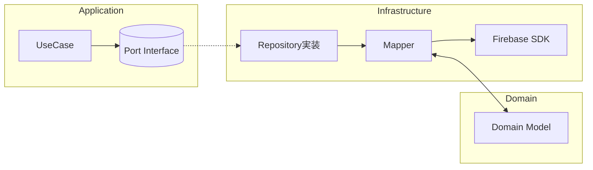

# 第4回：Firebaseへのマッピング（Infrastructure）

前回はアプリケーション層を実装しました。今回は**インフラ層**で、Firebaseとドメインモデルをつなぎます。

## 🏗️ インフラ層の責務



## 🔄 Mapper設計のコツ（ドメイン無知 + 型安全）

### FirestorePostRepository実装

```typescript
// packages/infrastructure/src/firebase/firestorePostRepository.ts
import { getFirestore, doc, setDoc, getDoc } from "firebase/firestore";
import { Post } from "@domain/post/Post";
import { PostId, UserId } from "@domain/shared/ids";
import { PostRepository } from "@application/ports/PostRepository";

const db = getFirestore();

export class FirestorePostRepository implements PostRepository {
  async save(post: Post) {
    const ref = doc(db, "posts", post.id as unknown as string);
    
    // ドメイン → DTO変換
    const data = {
      authorId: post["authorId"] as unknown as string,
      text: post.text,
      imageUrl: post.imageUrl ?? null,
      likeCount: post.likeCount,
      createdAt: new Date(post.createdAt),
    };
    
    await setDoc(ref, data, { merge: true });
  }

  async findById(id: PostId) {
    const snap = await getDoc(doc(db, "posts", id as unknown as string));
    
    if (!snap.exists()) return null;
    
    const d = snap.data();
    
    // DTO → ドメイン変換（reconstructメソッドを使用）
    return Post.reconstruct(
      id,
      UserId(d.authorId),
      d.text,
      d.imageUrl ?? null,
      d.createdAt.toDate?.() ?? new Date(d.createdAt),
      d.likeCount ?? 0
    );
  }
}
```

### なぜ `as unknown as string`？

```typescript
// ブランド型の変換
const postId: PostId = PostId("post-123");

// Firestore SDKは string を期待
doc(db, "posts", postId);  // ❌ 型エラー
doc(db, "posts", postId as unknown as string);  // ✅

// 将来的にはMapperクラスに分離
class PostMapper {
  static toFirestore(post: Post): DocumentData {
    return {
      authorId: this.unwrapId(post.authorId),
      // ...
    };
  }
  
  private static unwrapId(id: UserId | PostId): string {
    return id as unknown as string;
  }
}
```

## 📦 FirebaseStoragePort実装

```typescript
// packages/infrastructure/src/firebase/storagePort.ts
import { getStorage, ref, uploadBytes, getDownloadURL } from "firebase/storage";
import { StoragePort } from "@application/ports/StoragePort";
import { PostId } from "@domain/shared/ids";

const storage = getStorage();

export class FirebaseStoragePort implements StoragePort {
  async uploadPostImage(id: PostId, file: File) {
    // 1. パスを構築
    const r = ref(storage, `posts/${id}/image`);
    
    // 2. アップロード
    await uploadBytes(r, file);
    
    // 3. ダウンロードURL取得
    return await getDownloadURL(r);
  }
}
```

## 🚨 エッジケース対策

### タイムスタンプの扱い

```typescript
// Firestoreのタイムスタンプは特殊
const d = snap.data();

// serverTimestamp()を使った場合、初回はnull
d.createdAt;  // null | Timestamp

// 安全な変換
const createdAt = d.createdAt?.toDate?.() 
  ?? new Date(d.createdAt)  // 文字列の場合
  ?? new Date();             // nullの場合
```

### 部分的なデータ更新

```typescript
async save(post: Post) {
  // merge: trueで部分更新
  await setDoc(ref, data, { merge: true });
  
  // または updateDoc（ドキュメントが存在しない場合エラー）
  await updateDoc(ref, {
    text: post.text,
    updatedAt: serverTimestamp()
  });
}
```

### バッチ処理

```typescript
async saveMultiple(posts: Post[]) {
  const batch = writeBatch(db);
  
  for (const post of posts) {
    const ref = doc(db, "posts", post.id);
    const data = this.toFirestoreData(post);
    batch.set(ref, data);
  }
  
  // 最大500件まで
  await batch.commit();
}
```

## 🔐 セキュリティルールの考え方（二重防御）

### レイヤー別の防御

```javascript
// firestore.rules
rules_version = '2';
service cloud.firestore {
  match /databases/{database}/documents {
    // 第1層：認証チェック
    function isSignedIn() {
      return request.auth != null;
    }
    
    // 第2層：権限チェック
    function isOwner(uid) {
      return isSignedIn() && request.auth.uid == uid;
    }
    
    // 第3層：データ検証
    function isValidPost() {
      return request.resource.data.text is string &&
        request.resource.data.text.size() <= 300 &&
        (request.resource.data.text.size() > 0 || 
         request.resource.data.imageUrl != null);
    }
    
    match /posts/{postId} {
      allow read: if true;
      allow create: if isSignedIn() && 
        isValidPost() &&
        request.resource.data.authorId == request.auth.uid;
      allow update: if isOwner(resource.data.authorId) && 
        isValidPost();
      allow delete: if isOwner(resource.data.authorId);
    }
  }
}
```

### ドメイン層との対応

```typescript
// Domain層の不変条件
if (text.length === 0 && !imageUrl) {
  throw new Error("空投稿は禁止");
}

// セキュリティルールでも同じチェック
(request.resource.data.text.size() > 0 || 
 request.resource.data.imageUrl != null)
```

## 🧪 インフラ層のテスト（Emulator使用）

```typescript
// packages/infrastructure/src/firebase/firestorePostRepository.test.ts
import { describe, it, expect, beforeAll } from 'vitest';
import { initializeTestEnvironment } from '@firebase/rules-unit-testing';
import { FirestorePostRepository } from './firestorePostRepository';

describe('FirestorePostRepository', () => {
  let testEnv;
  let repo;

  beforeAll(async () => {
    // Emulator環境の初期化
    testEnv = await initializeTestEnvironment({
      projectId: "test-project",
      firestore: {
        rules: fs.readFileSync("../../../firestore.rules", "utf8"),
      },
    });
    
    repo = new FirestorePostRepository();
  });

  it('投稿を保存・取得できる', async () => {
    const post = Post.create({
      id: PostId('test-1'),
      authorId: UserId('user-1'),
      text: 'テスト投稿',
      now: new Date()
    });
    
    await repo.save(post);
    const retrieved = await repo.findById(PostId('test-1'));
    
    expect(retrieved?.text).toBe('テスト投稿');
  });
});
```

## 🔄 実装のベストプラクティス

### 1. Mapper を分離

```typescript
class PostMapper {
  static toDomain(data: DocumentData, id: string): Post {
    return Post.reconstruct(
      PostId(id),
      UserId(data.authorId),
      data.text,
      // ...
    );
  }
  
  static toFirestore(post: Post): DocumentData {
    return {
      authorId: this.unwrapId(post.authorId),
      text: post.text,
      // ...
    };
  }
}
```

### 2. エラーハンドリング

```typescript
async findById(id: PostId): Promise<Post | null> {
  try {
    const snap = await getDoc(doc(db, "posts", id));
    if (!snap.exists()) return null;
    return PostMapper.toDomain(snap.data(), snap.id);
  } catch (error) {
    if (error.code === 'permission-denied') {
      throw new UnauthorizedError('投稿の取得権限がありません');
    }
    throw error;
  }
}
```

### 3. キャッシュ戦略

```typescript
class CachedPostRepository implements PostRepository {
  private cache = new Map<string, Post>();
  
  async findById(id: PostId): Promise<Post | null> {
    const cached = this.cache.get(id as string);
    if (cached) return cached;
    
    const post = await this.firestoreRepo.findById(id);
    if (post) {
      this.cache.set(id as string, post);
    }
    return post;
  }
}
```

## 📝 学びの要点まとめ（3行）

1. **Mapper**でドメインとDBの型を変換
2. **セキュリティルール**でドメインルールを二重防御
3. **Emulator**でインフラ層もテスト可能

## 🎯 次回予告

第5回では、**UI（React）を最小で繋ぐ**：
- UseCaseを呼ぶフォーム・一覧
- タイムライン（フォローin句）小規模実装
- UXとドメインの境界線

いよいよUIとつなげます！