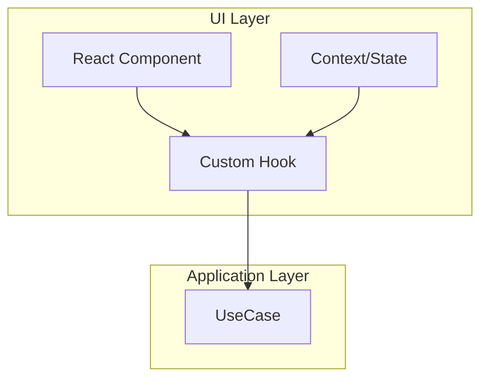

# 第5回：UI（React）を最小で繋ぐ

前回までで、ドメイン層からインフラ層まで実装しました。今回は**UI層**でReactコンポーネントとつなぎます。

## 🎨 UI層の設計方針



**原則**：
- UIコンポーネントは**ドメインロジックを知らない**
- UseCaseを通じて**ビジネスロジックを実行**
- 状態管理は**最小限**に

## 📝 UseCaseを呼ぶフォーム

### CreatePostForm実装

```tsx
// packages/web/src/features/post/CreatePostForm.tsx
import { useState } from "react";
import { CreatePost } from "@application/usecases/CreatePost";
import { FirestorePostRepository } from "@infrastructure/firebase/firestorePostRepository";
import { FirebaseStoragePort } from "@infrastructure/firebase/storagePort";
import { useAuthUser } from "../auth/useAuthUser";

export function CreatePostForm() {
  const [text, setText] = useState("");
  const [file, setFile] = useState<File | null>(null);
  const [isSubmitting, setIsSubmitting] = useState(false);
  const user = useAuthUser();

  async function submit(e: React.FormEvent) {
    e.preventDefault();
    if (!user) return;
    
    setIsSubmitting(true);
    
    try {
      // UseCase呼び出し（依存性注入）
      const uc = new CreatePost(
        new FirestorePostRepository(), 
        new FirebaseStoragePort()
      );
      
      await uc.exec({ 
        authorId: user.uid, 
        text, 
        file 
      });
      
      // フォームリセット
      setText("");
      setFile(null);
    } catch (error) {
      console.error("投稿失敗:", error);
      alert(error.message);
    } finally {
      setIsSubmitting(false);
    }
  }

  return (
    <form onSubmit={submit} className="post-form">
      <textarea 
        value={text} 
        onChange={e => setText(e.target.value)} 
        maxLength={300}
        placeholder="いま何してる？"
        disabled={isSubmitting}
      />
      
      <div className="char-count">{text.length}/300</div>
      
      <input 
        type="file" 
        accept="image/*" 
        onChange={e => setFile(e.target.files?.[0] ?? null)}
        disabled={isSubmitting}
      />
      
      <button 
        type="submit" 
        disabled={!user || isSubmitting || (!text && !file)}
      >
        {isSubmitting ? "投稿中..." : "投稿"}
      </button>
    </form>
  );
}
```

### 依存性注入の改善（DI Container）

```tsx
// packages/web/src/di/container.ts
import { CreatePost } from "@application/usecases/CreatePost";
import { FirestorePostRepository } from "@infrastructure/firebase/firestorePostRepository";
import { FirebaseStoragePort } from "@infrastructure/firebase/storagePort";

class DIContainer {
  private static instance: DIContainer;
  
  static getInstance() {
    if (!this.instance) {
      this.instance = new DIContainer();
    }
    return this.instance;
  }
  
  // UseCase生成
  createPost() {
    return new CreatePost(
      new FirestorePostRepository(),
      new FirebaseStoragePort()
    );
  }
}

// Hookで使いやすく
export function useCreatePost() {
  const di = DIContainer.getInstance();
  return di.createPost();
}
```

改善後：
```tsx
export function CreatePostForm() {
  const createPost = useCreatePost();  // DI済み
  
  async function submit(e: React.FormEvent) {
    await createPost.exec({ authorId, text, file });
  }
}
```

## 📋 投稿一覧の実装

```tsx
// packages/web/src/features/post/PostList.tsx
import { useEffect, useState } from "react";
import { Post } from "@domain/post/Post";
import { usePostRepository } from "../../hooks/useRepositories";

export function PostList() {
  const [posts, setPosts] = useState<Post[]>([]);
  const [loading, setLoading] = useState(true);
  const postRepo = usePostRepository();
  
  useEffect(() => {
    loadPosts();
  }, []);
  
  async function loadPosts() {
    try {
      const posts = await postRepo.findRecent(20);
      setPosts(posts);
    } finally {
      setLoading(false);
    }
  }
  
  if (loading) return <div>読み込み中...</div>;
  
  return (
    <div className="post-list">
      {posts.map(post => (
        <PostItem key={post.id} post={post} />
      ))}
    </div>
  );
}

function PostItem({ post }: { post: Post }) {
  return (
    <article className="post-item">
      <header>
        <span className="author">@{post.authorId}</span>
        <time>{formatDate(post.createdAt)}</time>
      </header>
      
      <div className="content">
        {post.text && <p>{post.text}</p>}
        {post.imageUrl && }
      </div>
      
      <footer>
        <LikeButton postId={post.id} initialCount={post.likeCount} />
      </footer>
    </article>
  );
}
```

## 🔄 タイムライン（フォローin句）小規模実装

```tsx
// packages/web/src/features/timeline/Timeline.tsx
import { useEffect, useState } from "react";
import { GetTimeline } from "@application/usecases/GetTimeline";
import { useAuth } from "../auth/useAuth";
import { PostList } from "../post/PostList";

export function Timeline() {
  const [posts, setPosts] = useState([]);
  const [loading, setLoading] = useState(true);
  const { user } = useAuth();
  
  useEffect(() => {
    if (!user) return;
    loadTimeline();
  }, [user]);
  
  async function loadTimeline() {
    const getTimeline = new GetTimeline(
      /* repositories */
    );
    
    const result = await getTimeline.exec({
      userId: user.uid,
      limit: 50
    });
    
    setPosts(result.posts);
    setLoading(false);
  }
  
  if (!user) return <div>ログインしてください</div>;
  if (loading) return <div>タイムライン読み込み中...</div>;
  
  return <PostList posts={posts} />;
}
```

### Firestoreクエリの実装

```typescript
// packages/infrastructure/src/firebase/firestorePostRepository.ts
async findByAuthors(authorIds: UserId[], limit: number): Promise<Post[]> {
  // Firestoreのin句は最大30件
  const chunks = chunk(authorIds, 30);
  const allPosts: Post[] = [];
  
  for (const chunk of chunks) {
    const q = query(
      collection(db, "posts"),
      where("authorId", "in", chunk.map(id => id as string)),
      orderBy("createdAt", "desc"),
      limit(limit)
    );
    
    const snap = await getDocs(q);
    const posts = snap.docs.map(doc => 
      this.fromFirestore(doc.data(), doc.id)
    );
    allPosts.push(...posts);
  }
  
  // マージしてソート
  return allPosts
    .sort((a, b) => b.createdAt.getTime() - a.createdAt.getTime())
    .slice(0, limit);
}
```

## 🎭 UXとドメインの境界線

### UIの関心事 vs ドメインの関心事

```tsx
// ❌ UIにドメインロジックが漏れている
function PostForm() {
  const [text, setText] = useState("");
  
  function validate() {
    if (text.length === 0 && !file) {  // ドメインルール
      setError("投稿内容または画像が必要です");
    }
    if (text.length > 300) {  // ドメインルール
      setError("300文字以内にしてください");
    }
  }
}

// ✅ ドメインロジックはドメイン層に
function PostForm() {
  async function submit() {
    try {
      // ドメイン層でバリデーション
      await createPost.exec({ text, file });
    } catch (error) {
      // ドメインエラーをUIエラーに変換
      setError(toUserMessage(error));
    }
  }
}
```

### リアルタイムバリデーション

```tsx
// UIレベルのバリデーション（UX向上）
function PostForm() {
  const remaining = 300 - text.length;
  const isOverLimit = remaining < 0;
  
  return (
    <>
      <textarea 
        value={text}
        onChange={e => setText(e.target.value)}
        className={isOverLimit ? "error" : ""}
      />
      <div className={isOverLimit ? "text-red" : ""}>
        残り{remaining}文字
      </div>
    </>
  );
}
```

## 🪝 カスタムフックでロジック分離

```tsx
// packages/web/src/hooks/useCreatePost.ts
export function useCreatePost() {
  const [loading, setLoading] = useState(false);
  const [error, setError] = useState<Error | null>(null);
  const createPost = useDI(CreatePost);
  
  const execute = useCallback(async (input: CreatePostInput) => {
    setLoading(true);
    setError(null);
    
    try {
      const result = await createPost.exec(input);
      return result;
    } catch (e) {
      setError(e);
      throw e;
    } finally {
      setLoading(false);
    }
  }, [createPost]);
  
  return { execute, loading, error };
}

// 使用側
function PostForm() {
  const { execute, loading, error } = useCreatePost();
  
  async function submit() {
    try {
      await execute({ text, file });
      // 成功処理
    } catch {
      // エラーは hook.error で取得可能
    }
  }
}
```

## 🎨 スタイリング（CSS-in-JS vs CSS Modules）

```tsx
// CSS Modules（推奨）
import styles from './PostForm.module.css';

export function PostForm() {
  return (
    <form className={styles.form}>
      <textarea className={styles.textarea} />
      <button className={styles.submitButton}>投稿</button>
    </form>
  );
}
```

```css
/* PostForm.module.css */
.form {
  display: flex;
  flex-direction: column;
  gap: 1rem;
}

.textarea {
  min-height: 100px;
  padding: 0.5rem;
  border: 1px solid #ddd;
  border-radius: 4px;
}

.submitButton {
  padding: 0.75rem 1.5rem;
  background: #1da1f2;
  color: white;
  border: none;
  border-radius: 9999px;
  font-weight: bold;
  cursor: pointer;
}

.submitButton:disabled {
  opacity: 0.5;
  cursor: not-allowed;
}
```

## 📝 学びの要点まとめ（3行）

1. **UIコンポーネント**はUseCaseを呼ぶだけ
2. **カスタムフック**でロジックを分離
3. **ドメインエラー**をユーザーメッセージに変換

## 🎯 次回予告（最終回）

第6回では、**デプロイ & 小さな拡張**：
- Hosting一発デプロイ
- いいね数の整合性（カウント再計算 / Cloud Functions案）
- 「イベント駆動/データメッシュ」への道筋

完成へ向けてラストスパート！