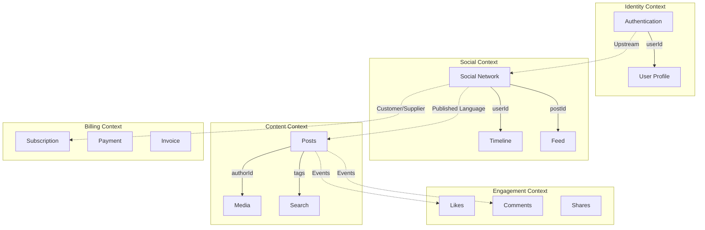

# 第6回：戦略的設計 - 境界づけられた文脈とコンテキストマップ

## 🤔 なぜシステムは複雑になるのか？

### モノリスの限界

```typescript
// ❌ すべてを1つのモデルで表現しようとした結果...
class User {
  // 認証関連
  email: string;
  hashedPassword: string;
  twoFactorSecret?: string;
  
  // SNS機能関連
  displayName: string;
  bio: string;
  followerCount: number;
  posts: Post[];
  
  // 課金関連
  customerId: string;
  subscription: 'free' | 'premium';
  paymentMethods: PaymentMethod[];
  invoices: Invoice[];
  
  // 通知関連
  notificationSettings: NotificationSettings;
  deviceTokens: string[];
  
  // 分析関連
  lastLoginAt: Date;
  loginHistory: LoginRecord[];
  engagementScore: number;
  
  // もはや何でも屋...
}
```

問題：
- **認知負荷が高い**（すべてを理解する必要）
- **変更の影響範囲が大きい**（1つの変更が全体に波及）
- **チーム間の調整コストが高い**（全員が同じコードを触る）

## 🎯 境界づけられた文脈（Bounded Context）

### 文脈によって意味が変わる

> 同じ「ユーザー」でも、文脈によって重要な属性が異なる

```typescript
// 認証文脈：セキュリティが最重要
namespace Authentication {
  export class User {
    constructor(
      readonly id: UserId,
      private email: Email,
      private hashedPassword: HashedPassword,
      private twoFactorEnabled: boolean,
      private lastLoginAt: Date
    ) {}
    
    authenticate(password: string): AuthResult {
      // パスワード検証ロジック
    }
    
    enableTwoFactor(): TwoFactorSecret {
      // 2要素認証の有効化
    }
  }
}

// SNS文脈：社交性が最重要
namespace SocialNetwork {
  export class User {
    constructor(
      readonly id: UserId,
      private profile: UserProfile,
      private stats: UserStats,
      private privacy: PrivacySettings
    ) {}
    
    post(content: PostContent): Post {
      // 投稿作成ロジック
    }
    
    follow(targetId: UserId): FollowRelation {
      // フォローロジック
    }
  }
}

// 課金文脈：支払い能力が最重要
namespace Billing {
  export class Customer {  // 「User」ではなく「Customer」
    constructor(
      readonly id: CustomerId,
      private subscription: Subscription,
      private paymentMethods: PaymentMethod[],
      private creditLimit: Money
    ) {}
    
    upgrade(): SubscriptionUpgrade {
      // アップグレードロジック
    }
    
    charge(amount: Money): PaymentResult {
      // 課金ロジック
    }
  }
}
```

### 境界の発見方法

1. **言語の違いを探す**
   - チームごとに異なる用語を使っているか？
   - 同じ言葉が違う意味で使われているか？

2. **変更の頻度とタイミング**
   - どの機能が一緒に変更されるか？
   - 独立して進化できる部分はどこか？

3. **チーム構造**
   - どのチームが責任を持つか？
   - 意思決定の単位はどこか？

## 🗺️ コンテキストマップ：全体像を描く

### システム全体の関係性



### 統合パターン

```typescript
// パターン1: 共有カーネル（Shared Kernel）
namespace SharedKernel {
  // 両方の文脈で共有する最小限のモデル
  export class UserId {
    constructor(readonly value: string) {}
    
    equals(other: UserId): boolean {
      return this.value === other.value;
    }
  }
  
  export class PostId {
    constructor(readonly value: string) {}
  }
}

// パターン2: 顧客/供給者（Customer-Supplier）
namespace ContentContext {
  export interface PostService {
    // 下流（Social Context）のニーズに応える
    getTimelinePosts(userId: string): Promise<TimelinePost[]>;
    getPopularPosts(limit: number): Promise<PopularPost[]>;
  }
}

// パターン3: 公開ホストサービス（Open Host Service）
namespace IdentityContext {
  export class AuthenticationAPI {
    // 標準化されたインターフェース
    async verifyToken(token: string): Promise<TokenInfo> {
      // JWTトークンの検証
      return {
        userId: decoded.sub,
        email: decoded.email,
        roles: decoded.roles
      };
    }
  }
}

// パターン4: 腐敗防止層（Anti-Corruption Layer）
namespace BillingContext {
  export class UserAdapter {
    constructor(private snsApi: SNSApiClient) {}
    
    // 外部の複雑なモデルから自分たちのモデルへ変換
    async getCustomer(userId: string): Promise<Customer> {
      const snsUser = await this.snsApi.getUser(userId);
      
      // SNSのUserをBillingのCustomerに変換
      return new Customer(
        new CustomerId(userId),
        this.mapSubscription(snsUser.accountType),
        snsUser.email
      );
    }
    
    private mapSubscription(accountType: string): Subscription {
      // マッピングロジック
      switch(accountType) {
        case 'premium': return Subscription.PREMIUM;
        case 'pro': return Subscription.PROFESSIONAL;
        default: return Subscription.FREE;
      }
    }
  }
}
```

## 🎭 イベント駆動による疎結合

### ドメインイベントで文脈を繋ぐ

```typescript
// Content Context: イベントを発行
namespace ContentContext {
  export class Post {
    publish(): void {
      this.status = PostStatus.PUBLISHED;
      
      // イベントを発行（他の文脈は知らない）
      this.addEvent(new PostPublished({
        postId: this.id,
        authorId: this.authorId,
        content: this.content.toSummary(),
        publishedAt: new Date()
      }));
    }
  }
}

// Social Context: イベントを購読
namespace SocialContext {
  export class TimelineUpdater {
    @EventHandler(PostPublished)
    async handlePostPublished(event: PostPublished): Promise<void> {
      // 自分たちの文脈で必要な処理
      const followers = await this.followRepo
        .findFollowers(event.authorId);
      
      for (const follower of followers) {
        await this.timelineRepo.addPost(
          follower.id,
          new TimelineEntry(
            event.postId,
            event.authorId,
            event.publishedAt
          )
        );
      }
    }
  }
}

// Engagement Context: 同じイベントを別の用途で購読
namespace EngagementContext {
  export class EngagementTracker {
    @EventHandler(PostPublished)
    async handlePostPublished(event: PostPublished): Promise<void> {
      // エンゲージメント分析の初期化
      await this.metricsRepo.initializeMetrics(
        event.postId,
        event.authorId
      );
    }
  }
}
```

## 🏢 チーム構造との整合

### コンウェイの法則

> システムの構造は、それを作る組織の構造を反映する

```typescript
// チームごとに境界づけられた文脈を持つ
namespace TeamStructure {
  // Identity Team の責任範囲
  export interface IdentityTeam {
    contexts: ['Authentication', 'Authorization'];
    responsibilities: [
      'ユーザー認証',
      'アクセス制御',
      'セッション管理'
    ];
    techStack: ['Node.js', 'JWT', 'Redis'];
  }
  
  // Content Team の責任範囲
  export interface ContentTeam {
    contexts: ['Posts', 'Media', 'Search'];
    responsibilities: [
      'コンテンツ作成',
      'メディア管理',
      '検索機能'
    ];
    techStack: ['Node.js', 'Elasticsearch', 'S3'];
  }
  
  // Platform Team の責任範囲
  export interface PlatformTeam {
    contexts: ['SharedKernel', 'Infrastructure'];
    responsibilities: [
      '共通コンポーネント',
      'インフラ管理',
      'CI/CD'
    ];
    techStack: ['Kubernetes', 'Terraform', 'GitHub Actions'];
  }
}
```

### チーム間のコミュニケーション

```typescript
// API契約で明確な境界を作る
export interface TeamContract {
  // Content Team → Social Team
  ContentToSocial: {
    events: [
      'PostPublished',
      'PostDeleted',
      'PostUpdated'
    ];
    apis: [
      'GET /posts/{id}',
      'GET /posts/timeline/{userId}'
    ];
    sla: {
      availability: '99.9%',
      latency: 'p99 < 200ms'
    };
  };
  
  // Social Team → Identity Team
  SocialToIdentity: {
    apis: [
      'POST /auth/verify',
      'GET /users/{id}/profile'
    ];
    rateLimit: '1000 req/min';
    authentication: 'Bearer Token';
  };
}
```

## 🎯 イベントストーミング：ドメインを可視化する

### ドメインイベントから始める発見手法

イベントストーミングは、付箋を使ってビジネスフローを可視化する手法です：

```
[時系列に並べる]
→ ユーザー登録した
→ プロフィール設定した
→ 初投稿した
→ フォロワーができた
→ バズった
→ インフルエンサーになった
```

### イベントストーミングの実践

**1. オレンジの付箋：ドメインイベント**
```typescript
// 過去形で書く（起きたこと）
type DomainEvents = 
  | "ユーザーが登録された"
  | "投稿が作成された"
  | "いいねされた"
  | "フォローされた"
  | "通知が送信された";
```

**2. 青の付箋：コマンド**
```typescript
// 命令形で書く（やりたいこと）
type Commands = 
  | "ユーザーを登録する"
  | "投稿を作成する"
  | "いいねする"
  | "フォローする";
```

**3. 黄色の付箋：アクター**
```typescript
// 誰がそのコマンドを実行するか
type Actors = 
  | "新規ユーザー"
  | "既存ユーザー"
  | "システム管理者"
  | "バッチ処理";
```

**4. ピンクの付箋：ホットスポット**
```typescript
// 問題や疑問点
type HotSpots = 
  | "スパム投稿をどう防ぐ？"
  | "大量フォロワーの通知をどう処理？"
  | "不適切コンテンツの判定基準は？";
```

### 実践例：投稿作成フローの分析

```
[アクター]     [コマンド]        [イベント]         [ポリシー]
ユーザー   →  投稿を作成  →  投稿が作成された  →  もし10万フォロワー以上なら
                                              →  トレンド判定する
                                              
                            →  通知が必要と判定された  →  フォロワーに通知する
                            
                            →  スパムと判定された     →  投稿を非公開にする
                                                    →  管理者に通知する
```

### コードへの落とし込み

```typescript
// イベントストーミングから発見したポリシー
export class PostCreationPolicy {
  async handle(event: PostCreated): Promise<void> {
    const author = await this.userRepo.findById(event.authorId);
    
    // ホットスポットから発見したルール
    if (await this.spamDetector.isSpam(event.content)) {
      await this.handleSpamPost(event);
      return;
    }
    
    // 大量フォロワーの場合の特別処理
    if (author.followerCount > 100000) {
      await this.trendAnalyzer.analyze(event);
    }
    
    // 通常の通知処理
    await this.notificationService.notifyFollowers(event);
  }
}
```

## 🔄 進化的アーキテクチャ

### 段階的な分離

```typescript
// Phase 1: モジュラーモノリス
namespace MonolithPhase {
  // 同じプロセス内だが、明確な境界を持つ
  export class Application {
    modules = {
      identity: new IdentityModule(),
      social: new SocialModule(),
      content: new ContentModule(),
      billing: new BillingModule()
    };
  }
}

// Phase 2: サービス分離の準備
namespace TransitionPhase {
  // インターフェースで抽象化
  export interface ContentService {
    createPost(input: CreatePostInput): Promise<Post>;
    getPost(id: string): Promise<Post>;
  }
  
  // ローカル実装
  export class LocalContentService implements ContentService {
    async createPost(input: CreatePostInput): Promise<Post> {
      return this.postRepo.save(Post.create(input));
    }
  }
  
  // リモート実装（将来の分離に備える）
  export class RemoteContentService implements ContentService {
    async createPost(input: CreatePostInput): Promise<Post> {
      const response = await fetch('/api/posts', {
        method: 'POST',
        body: JSON.stringify(input)
      });
      return response.json();
    }
  }
}

// Phase 3: マイクロサービス化
namespace MicroservicePhase {
  // 独立したサービスとして運用
  export class ContentMicroservice {
    standalone = true;
    database = 'content_db';
    deployment = 'kubernetes';
    team = 'content-team';
  }
}
```

## 💡 実装例：SNSの境界づけられた文脈

### 具体的な分離例

```typescript
// 1. Identity Context (認証・認可)
namespace Identity {
  export const models = {
    User: class User {
      id: UserId;
      email: Email;
      passwordHash: string;
      roles: Role[];
    },
    Session: class Session {
      token: string;
      userId: UserId;
      expiresAt: Date;
    }
  };
  
  export const services = {
    AuthenticationService,
    AuthorizationService,
    TokenService
  };
}

// 2. Social Graph Context (フォロー関係)
namespace SocialGraph {
  export const models = {
    FollowRelation: class FollowRelation {
      followerId: UserId;
      followeeId: UserId;
      followedAt: Date;
    },
    Block: class Block {
      blockerId: UserId;
      blockedId: UserId;
    }
  };
  
  export const services = {
    FollowService,
    RecommendationService,
    GraphAnalysisService
  };
}

// 3. Content Context (投稿)
namespace Content {
  export const models = {
    Post: class Post {
      id: PostId;
      authorId: UserId;
      content: PostContent;
      visibility: Visibility;
    },
    Media: class Media {
      id: MediaId;
      postId: PostId;
      url: string;
      type: MediaType;
    }
  };
  
  export const services = {
    PostService,
    MediaService,
    ModerationService
  };
}

// 4. Engagement Context (エンゲージメント)
namespace Engagement {
  export const models = {
    Like: class Like {
      postId: PostId;
      userId: UserId;
      likedAt: Date;
    },
    Comment: class Comment {
      id: CommentId;
      postId: PostId;
      authorId: UserId;
      content: string;
    }
  };
  
  export const services = {
    LikeService,
    CommentService,
    EngagementAnalytics
  };
}

// 5. Notification Context (通知)
namespace Notification {
  export const models = {
    Notification: class Notification {
      id: NotificationId;
      userId: UserId;
      type: NotificationType;
      content: NotificationContent;
      read: boolean;
    }
  };
  
  export const services = {
    NotificationService,
    PushNotificationService,
    EmailNotificationService
  };
}
```

## 🌍 現実世界でのDDD導入

### 小さく始める、部分的に導入する

DDDを全面的に導入する必要はありません：

```typescript
// Step 1: 最も複雑な部分から始める
export class DDDAdoptionStrategy {
  // 中核ドメインの1機能だけDDDで実装
  startSmall(): void {
    // 例：投稿機能だけドメインモデルで実装
    const postAggregate = new PostAggregate();
    // 他の部分は既存のまま
  }
  
  // Step 2: 成功したら徐々に拡大
  expand(): void {
    // フォロー機能もDDDに移行
    // ユーザー管理もDDDに移行
  }
  
  // Step 3: チームの理解度に合わせて深化
  deepen(): void {
    // イベントソーシング導入
    // CQRS導入
    // イベント駆動アーキテクチャ導入
  }
}
```

### 組織への説得方法

```typescript
interface DDDValueProposition {
  // ビジネス側への説明
  forBusiness: {
    value: "ビジネスルールがコードに明確に表現される";
    benefit: "仕様変更が早く確実に反映される";
    example: "投稿ルールの変更が1箇所の修正で完了";
  };
  
  // 技術側への説明
  forEngineers: {
    value: "複雑さが管理可能になる";
    benefit: "テストが書きやすく、バグが減る";
    example: "ビジネスロジックとインフラが分離";
  };
  
  // 経営側への説明
  forManagement: {
    value: "開発速度が持続する";
    benefit: "技術的負債が蓄積しにくい";
    example: "新機能追加時の影響範囲が明確";
  };
}
```

### アンチパターンを避ける

```typescript
// ❌ DDDのアンチパターン
class DDDAntiPatterns {
  // 1. 過度な抽象化
  overEngineering = "単純な機能にも複雑な設計を適用";
  
  // 2. ドメインエキスパート不在
  noExpert = "開発者だけでドメインモデルを決める";
  
  // 3. 境界の誤り
  wrongBoundaries = "技術的な都合で境界を決める";
  
  // 4. 早すぎる分割
  prematureSeparation = "理解が浅いうちにマイクロサービス化";
}

// ✅ 正しいアプローチ
class DDDBestPractices {
  // 1. 適切な複雑さ
  rightComplexity = "複雑な部分にだけDDDを適用";
  
  // 2. 継続的な対話
  continuousDialogue = "ドメインエキスパートと定期的に会話";
  
  // 3. 進化する境界
  evolvingBoundaries = "理解が深まるごとに境界を調整";
  
  // 4. モノリスから始める
  startWithMonolith = "モジュラーモノリスで境界を探る";
}
```

## 📝 まとめ：戦略的設計の価値

**境界づけられた文脈の効果**：
- 認知負荷の軽減
- 独立した進化
- チームの自律性

**コンテキストマップの価値**：
- システム全体の可視化
- 統合ポイントの明確化
- 依存関係の管理

**イベントストーミングの効果**：
- ドメイン知識の共有
- 問題点の早期発見
- チーム全体の理解促進

**進化的アーキテクチャ**：
- 段階的な改善
- リスクの最小化
- ビジネス価値の継続的提供

## 🎉 連載を終えて

6回にわたってDDDの本質を探求してきました：

1. **なぜDDDが必要か** - ビジネスとコードの一致
2. **エンティティと値オブジェクト** - 同一性と不変性
3. **集約** - トランザクション境界の設計
4. **リポジトリ** - 永続化の抽象化
5. **アプリケーションサービス** - ユースケースの実装
6. **戦略的設計** - 大規模システムの構造化

DDDは単なる実装パターンではなく、**複雑なビジネスをソフトウェアで表現する思考法**です。

小さく始めて、必要に応じて境界を見つけ、段階的に洗練させていく。それがDDDの実践です。

---

## 📝 演習課題

### 課題1：コンテキストマップを描く
あなたのアプリケーション（またはSNS）のコンテキストマップを描いてみましょう：

```
[Context A] ←─関係性─→ [Context B]
     ↓                      ↑
   関係性                 関係性
     ↓                      ↑
[Context C] ←─関係性─→ [Context D]
```

それぞれの関係性を以下から選んでください：
- Partnership（良きパートナー）
- Customer-Supplier（利用者/供給者）
- Separate Ways（独立）

### 課題2：イベントストーミング実践
「ユーザー登録から初投稿まで」のフローをイベントストーミングで分析してみましょう：

| 時間 | アクター | コマンド | イベント | ポリシー |
|------|---------|---------|---------|---------|
| 1 | 新規ユーザー | アカウント作成 | ユーザーが登録された | |
| 2 | | | | ウェルカムメール送信 |
| 3 | | | | |
| 4 | | | | |

### 課題3：進化的アーキテクチャの計画
現在のシステムを段階的にDDD化する計画を立ててみましょう：

**Phase 1（3ヶ月）**：
- どの部分から始める？
- なぜその部分を選ぶ？

**Phase 2（6ヶ月）**：
- 次に取り組む部分は？
- Phase 1の学びをどう活かす？

**Phase 3（1年後）**：
- 最終的な理想形は？
- どんな価値が生まれる？

**最終課題**：これらの演習を通じて、あなたのシステムで「異なるチームが異なる言葉を使っている」部分を見つけて、境界づけられた文脈として分離できないか考えてみてください。

Happy Domain Modeling! 🎯