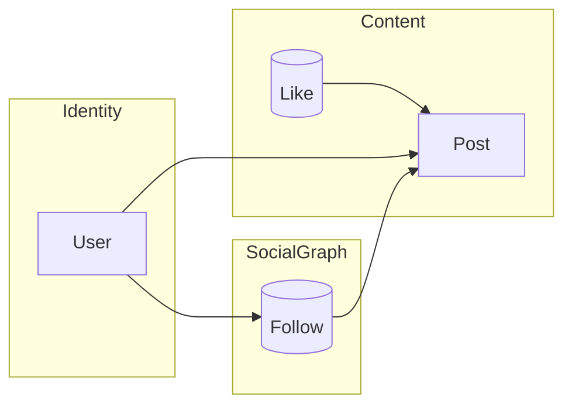
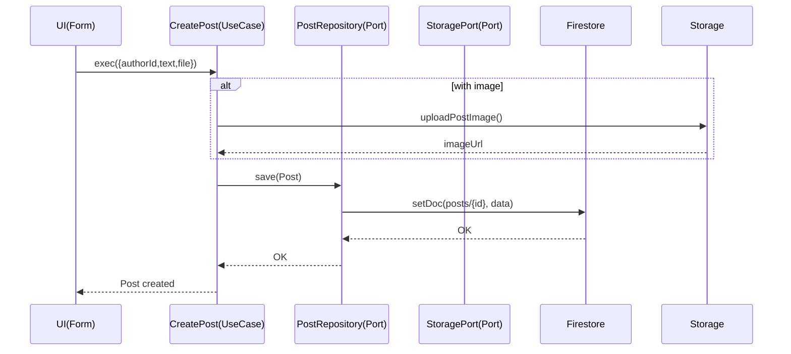

最高です。では **「All Firebase × React（Vite）」で、コード解説濃いめ＋図（Mermaid）つき** のハンズオン設計書＆初稿をここでまとめます。
以降はこの設計書を Cursor/Claude に投げれば、そのままリポジトリ実装→記事化まで走れます。

---

# ハンズオン全体像（小さなSNSを題材にDDDを学ぶ）

## ねらい

* バックエンドを極力持たず **Firebase（Auth / Firestore / Storage / Hosting /（任意）Cloud Functions）** だけで完走。
* **DDD の型**（境界づけられた文脈 / 集約 / リポジトリ / アプリケーションサービス / ドメインイベント）を **フロントエンド主導**で実感。
* コードで理解：**ドメイン層は純粋な TypeScript**、インフラ層で Firebase に橋渡し。

## 作るもの（MVP）

* サインイン（Google）
* 投稿（テキスト + 画像1枚まで）
* タイムライン（フォロー相手の新着）
* いいね / フォロー
* プロフィール編集
  -（任意）通知バッジ

---

# リポジトリ設計（DDDのレイヤとFirebaseの接着）

```
sns-ddd-firebase/
├─ packages/
│  ├─ domain/                 # 純TS: Entity/ValueObject/Aggregate/DomainEvents
│  ├─ application/            # UseCase (サービス) + ポート（Repository IF）
│  ├─ infrastructure/         # Firebase 実装（Firestore/Storage/Auth）+ mappers
│  └─ web/                    # React(Vite) UI（presentation層）
├─ functions/                 # （任意）Cloud Functions（集約超えの非同期処理）
├─ firebase.json              # Hosting / Emulators 設定
├─ firestore.indexes.json
├─ firestore.rules
├─ storage.rules
└─ .github/workflows/deploy.yml（任意）
```

> **ポイント**
>
> * `domain` は **Firebase無知**。型＆不変条件＆ビジネスルールに集中。
> * `application` は **UseCase**（例：`CreatePost`, `FollowUser`）。複数Repoを協調、**トランザクション境界**の意識付け。
> * `infrastructure` が Firebase SDK を握る。**DTO ↔︎ ドメイン**をMapperで変換。
> * `web` はコンポーネントから UseCase を呼び出すだけ。UIロジックとドメインを分離。

---

# 分割（境界づけられた文脈 / 集約の粒度）

## 文脈（軽量）

* **Identity**（ユーザ登録・プロフィールの基本）
* **SocialGraph**（フォロー/フォロワー関係）
* **Content**（Post/Like/Timeline 投影）

Mermaid 図：



## 集約

* **User**（プロフィール編集の不変条件を担保）
* **Post**（「投稿の作成/編集」「いいね付与/解除」の不変条件を担保）
* **FollowRelation**（フォローの重複禁止・自己フォロー禁止）
* **Like**（`UserId x PostId` のユニーク制約）

> Firestoreは**強い整合トランザクションがコレクション間で弱い**ため、
> \*\*不変条件はできるだけ「単一集約内」\*\*に閉じる or **application層で補助的チェック**を行い、**セキュリティルール**でも二重防御する。

---

# Firestore データモデル（最小）

```
/users/{userId}             // Identity
  - displayName
  - photoURL
  - createdAt

/follows/{userId}/to/{followeeId}     // SocialGraph: userId が followeeId をフォロー
  - createdAt

/posts/{postId}             // Content
  - authorId
  - text
  - imageUrl
  - likeCount
  - createdAt

/likes/{postId}/by/{userId} // Content: いいね
  - createdAt
```

**インデックス例**

* `posts`：`createdAt DESC` + `authorId`（ユーザ別新着）
* timeline は今回は **クエリ合成**で簡易に（フォロー先一覧→ in句で取得）。
  ※ in句の上限やパフォーマンスは小規模SNS前提でOK。拡張は付録で（Materialized Timeline/Functions）。

---

# セキュリティルール骨子（抜粋）

```
// firestore.rules（概念的イメージ）
match /databases/{db}/documents {
  function isSignedIn()     { return request.auth != null; }
  function isSelf(uid)      { return isSignedIn() && request.auth.uid == uid; }
  function now()            { return request.time; }

  match /users/{uid} {
    allow read: if true;
    allow create: if isSelf(uid);
    allow update: if isSelf(uid); // プロフィールの一部のみ更新許可を付与（検査）
  }

  match /follows/{uid}/to/{followeeId} {
    allow read: if isSignedIn();
    allow create: if isSelf(uid) && request.resource.data.keys().hasOnly(['createdAt']);
    allow delete: if isSelf(uid);
  }

  match /posts/{postId} {
    allow read: if true;
    allow create: if isSignedIn();
    allow update, delete: if resource.data.authorId == request.auth.uid; // 自分の投稿のみ
  }

  match /likes/{postId}/by/{uid} {
    allow read: if isSignedIn();
    allow create: if isSelf(uid);
    allow delete: if isSelf(uid);
  }
}
```

---

# ドメイン層（純TS）サンプル

**ValueObject / Entity / Aggregate（例：Post）**

```ts
// packages/domain/src/shared/ids.ts
export type UserId = string & { readonly brand: unique symbol };
export type PostId = string & { readonly brand: unique symbol };

export const UserId = (v: string) => v as UserId;
export const PostId = (v: string) => v as PostId;

// packages/domain/src/post/Post.ts
import { PostId, UserId } from "../shared/ids";

export class Post {
  private constructor(
    readonly id: PostId,
    readonly authorId: UserId,
    private _text: string,
    private _imageUrl: string | null,
    readonly createdAt: Date,
    private _likeCount: number
  ) {}

  static create(args: {
    id: PostId; authorId: UserId; text: string; imageUrl?: string | null; now: Date;
  }) {
    const text = (args.text ?? "").trim();
    if (text.length === 0 && !args.imageUrl) throw new Error("空投稿は禁止");
    if (text.length > 300) throw new Error("本文は300文字以内");
    return new Post(args.id, args.authorId, text, args.imageUrl ?? null, args.now, 0);
  }

  get text() { return this._text; }
  get imageUrl() { return this._imageUrl; }
  get likeCount() { return this._likeCount; }

  edit(by: UserId, next: { text?: string; imageUrl?: string | null }) {
    if (by !== this.authorId) throw new Error("編集権限なし");
    const t = (next.text ?? this._text).trim();
    if (t.length === 0 && !next.imageUrl) throw new Error("空投稿は禁止");
    if (t.length > 300) throw new Error("本文は300文字以内");
    this._text = t;
    this._imageUrl = next.imageUrl ?? this._imageUrl;
  }

  applyLike(delta: 1 | -1) {
    this._likeCount = Math.max(0, this._likeCount + delta);
  }
}
```

---

# アプリケーション層（UseCase）サンプル

```ts
// packages/application/src/ports/PostRepository.ts
import { Post } from "@domain/post/Post";
import { PostId } from "@domain/shared/ids";

export interface PostRepository {
  save(post: Post): Promise<void>;
  findById(id: PostId): Promise<Post | null>;
}
```

```ts
// packages/application/src/usecases/CreatePost.ts
import { nanoid } from "nanoid";
import { Post } from "@domain/post/Post";
import { PostId, UserId } from "@domain/shared/ids";
import { PostRepository } from "../ports/PostRepository";
import { StoragePort } from "../ports/StoragePort";

export class CreatePost {
  constructor(private posts: PostRepository, private storage: StoragePort) {}

  async exec(input: {
    authorId: string; text: string; file?: File | null;
  }) {
    const id = PostId(nanoid());
    const authorId = UserId(input.authorId);
    let imageUrl: string | null = null;
    if (input.file) {
      imageUrl = await this.storage.uploadPostImage(id, input.file);
    }
    const post = Post.create({
      id, authorId, text: input.text, imageUrl, now: new Date(),
    });
    await this.posts.save(post);
    return post;
  }
}
```

---

# インフラ層（Firebase 実装）サンプル

```ts
// packages/infrastructure/src/firebase/firestorePostRepository.ts
import { getFirestore, doc, setDoc, getDoc } from "firebase/firestore";
import { Post } from "@domain/post/Post";
import { PostId, UserId } from "@domain/shared/ids";
import { PostRepository } from "@application/ports/PostRepository";

const db = getFirestore();

export class FirestorePostRepository implements PostRepository {
  async save(post: Post) {
    const ref = doc(db, "posts", post.id as unknown as string);
    const data = {
      authorId: post["authorId"] as unknown as string,
      text: post.text,
      imageUrl: post.imageUrl ?? null,
      likeCount: post.likeCount,
      createdAt: new Date(post.createdAt),
    };
    await setDoc(ref, data, { merge: true });
  }

  async findById(id: PostId) {
    const snap = await getDoc(doc(db, "posts", id as unknown as string));
    if (!snap.exists()) return null;
    const d = snap.data();
    return new (Post as any)(
      id,
      UserId(d.authorId),
      d.text,
      d.imageUrl ?? null,
      d.createdAt.toDate?.() ?? new Date(d.createdAt),
      d.likeCount ?? 0
    ) as Post;
  }
}
```

```ts
// packages/infrastructure/src/firebase/storagePort.ts
import { getStorage, ref, uploadBytes, getDownloadURL } from "firebase/storage";
import { StoragePort } from "@application/ports/StoragePort";
import { PostId } from "@domain/shared/ids";

const storage = getStorage();

export class FirebaseStoragePort implements StoragePort {
  async uploadPostImage(id: PostId, file: File) {
    const r = ref(storage, `posts/${id}/image`);
    await uploadBytes(r, file);
    return await getDownloadURL(r);
  }
}
```

---

# UI（React / Vite）サンプル（最小）

```tsx
// packages/web/src/features/post/CreatePostForm.tsx
import { useState } from "react";
import { CreatePost } from "@application/usecases/CreatePost";
import { FirestorePostRepository } from "@infrastructure/firebase/firestorePostRepository";
import { FirebaseStoragePort } from "@infrastructure/firebase/storagePort";
import { useAuthUser } from "../auth/useAuthUser";

export function CreatePostForm() {
  const [text, setText] = useState("");
  const [file, setFile] = useState<File | null>(null);
  const user = useAuthUser();

  async function submit(e: React.FormEvent) {
    e.preventDefault();
    if (!user) return;
    const uc = new CreatePost(new FirestorePostRepository(), new FirebaseStoragePort());
    await uc.exec({ authorId: user.uid, text, file });
    setText("");
    setFile(null);
  }

  return (
    <form onSubmit={submit}>
      <textarea value={text} onChange={e=>setText(e.target.value)} maxLength={300} />
      <input type="file" accept="image/*" onChange={e=>setFile(e.target.files?.[0] ?? null)} />
      <button type="submit" disabled={!user}>Post</button>
    </form>
  );
}
```

---

# 図で理解（Mermaid）

**レイヤ分離**

```mermaid
flowchart TB
  UI[React Components] --> APP[Application UseCases]
  APP --> PORTS[(Ports: Repository, Storage)]
  PORTS --> INFRA[Infrastructure: Firebase adapters]
  subgraph Domain (pure TS)
    ENT[Entities / Aggregates]
    VO[ValueObjects]
    EVT[DomainEvents]
  end
  APP --> ENT
  APP --> EVT
```

**ユースケースの流れ（CreatePost）**



---

# デプロイ簡潔手順（All Firebase）

1. Firebase プロジェクト作成（Spark/無料）
2. `firebase init`（Hosting/Firestore/Storage/Functions(任意)/Emulators）
3. Webアプリ登録 → SDKキーを `.env` or `web/src/firebase.ts` に設定
4. ローカル起動：`firebase emulators:start`（＋ `pnpm dev`）
5. ルール & インデックスを反映：

   ```
   firebase deploy --only firestore:rules,firestore:indexes,storage
   ```
6. ホスティング：

   * Vite ビルド → `firebase deploy --only hosting`

> 本編では 5〜10分の縮約版を掲載、詳細は付録に。

---

# 記事（連載）アウトライン & 台本

## 連載タイトル

**「小さなSNSを作りながら学ぶDDD — All Firebaseで“使える設計”を体感する」**

### 第1回：DDDの最短コース + なぜAll Firebaseか

* 目的・完成像デモGIF
* DDD超要約（文脈/集約/レイヤ）
* Firebaseで余計な配線を減らし**設計学習に集中**する狙い
* リポジトリ構成と思想（Mermaid図）

### 第2回：ドメインモデルを書く（純TS）

* ValueObject / Entity / Aggregate の実装
* 不変条件・ガードの置き場
* 単体テスト（Vitest）でドメインを守る

### 第3回：アプリケーションサービス（UseCase）とポート

* CreatePost / FollowUser / ToggleLike
* ポート設計（Repository / Storage）
* 「トランザクション境界」の現実（Firestoreの制約との向き合い方）

### 第4回：Firebaseへのマッピング（Infrastructure）

* Mapper設計のコツ（ドメイン無知 + 型安全）
* Firestore/Storage 実装とエッジケース
* セキュリティルールの考え方（二重防御）

### 第5回：UI（React）を最小で繋ぐ

* UseCase を呼ぶフォーム・一覧
* タイムライン（フォローin句）小規模実装
* UXとドメインの境界線

### 第6回：デプロイ & 小さな拡張

* Hosting 一発デプロイ
* いいね数の整合性（カウント再計算 / Cloud Functions案）
* 「イベント駆動/データメッシュ」への道筋（読み物）

> 各回：**コード > 図 > 説明** の順でテンポ良く。
> 末尾に「学びの要点まとめ（3行）」＋「次回の予告」。

---

# 最初の PR 指示（Cursor/Claude 用プロンプト）

> **タスク**: モノレポ（pnpm）で `domain / application / infrastructure / web` を作成し、Vite+React+TS で起動、Firebase SDK 初期化ファイル、最低限のドメイン（Post）と CreatePost UseCase、Firestore 実装、フォームを動かす。
> **要件**:
>
> * パッケージ横断のTSパスエイリアス（`@domain/*`, `@application/*`, `@infrastructure/*`）を設定
> * Firebase は環境変数で設定 or `web/src/firebase.ts` に直書き（後で差し替えOK）
> * `firebase.json`, `firestore.rules`, `firestore.indexes.json`, `storage.rules` 雛形を置く
> * `CreatePostForm` がローカルエミュレータで保存まで動くこと
> * Vitest で `domain` の単体テスト1本（`Post.create` のガード）を通す
>
> **完了条件**:
>
> * `pnpm i && pnpm -r build` が通る
> * `pnpm -C packages/web dev` でフォームが開き、投稿すると Firestore に書ける
> * 主要ファイルに JSDoc コメントを付与（なぜそれがDDD的にそこにあるかを短文で）

---

# 記事に貼る「最初のコード」ひとかたまり

* 上に示した `Post`、`CreatePost`、`FirestorePostRepository`、`CreatePostForm` をそのまま第2〜5回で展開。
* Mermaid 図は記事中に貼り付け可能（GitHub READMEでもOK）。

---

# 次のアクション（ここから実装）

1. この設計書を Cursor/Claude に貼り、**初期モノレポ生成PR** を作らせる
2. ローカルで Emulators 起動 → 投稿1件が保存できるまで確認
3. 連載第1回の本文（導入＋構成＋図）を this 設計書から整形
4. 以降、回ごとに PR を刻んで進める

---